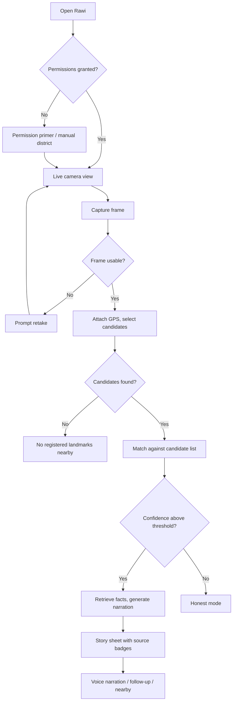
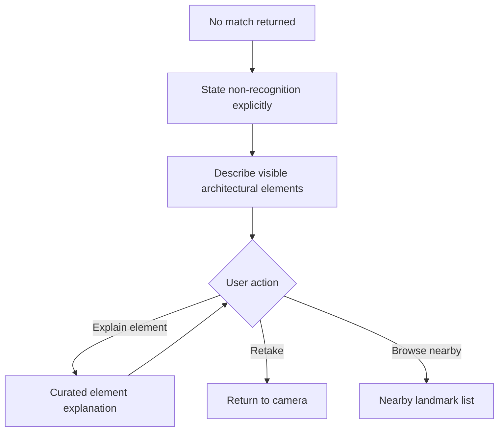
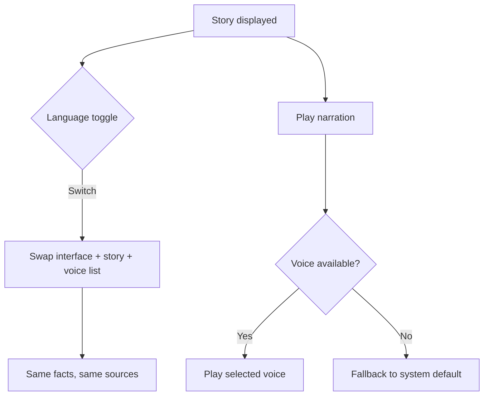
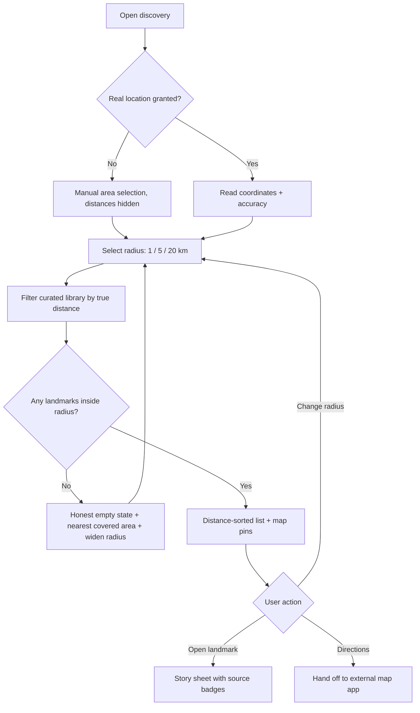

# Product Requirements Document
# Rawi (راوي) — The Guide That Refuses to Lie

> **Generated via the 10-agent pipeline** · Agents 1–8 (core) + Agent 9 (Task Export)
> **Preferences resolved:** platform `web` · complexity `mvp` · theme `both` · taskExport `true` · tddErd `false`
> **Context:** AI Champion Challenge 2026, Track 03 (Smart Tourism) · 4-person team · 5-day build

---

## 1. Product Vision

Every heritage district is full of buildings with stories no visitor can access. There is no sign, no guide, and no reliable answer online. Visitors either walk past in ignorance — or ask an AI assistant that invents a confident, fluent, completely fabricated history.

**Rawi is a web app that lets a tourist point their phone camera at a heritage landmark and instantly hear its verified story in Arabic or English — with a visible source under every fact.**

Its defining behaviour is not what it knows. It is what it refuses to say. When Rawi does not recognise a building, it says so plainly and describes only the architectural elements it can actually see, offering to explain them — instead of guessing a name, a date, or a story.

**Positioning statement:** *Point and learn — and when we don't know, we'll tell you.*

---

## 2. PRD Overview

### 2.1 Project summary

A responsive web MVP that identifies heritage landmarks from a live camera feed by matching the photo against a **curated, closed library of 12 landmarks in a single district**, narrowed first by the user's GPS position. Verified facts are retrieved from that library and narrated bilingually with source attribution and optional voice playback.

**Inferred domain:** location-aware cultural-heritage guide (consumer travel utility)

### 2.2 Normalized brief

A responsive web MVP for tourists visiting a heritage district. The user opens a live in-page camera, captures a landmark, and receives its identity and verified story in Arabic and English. Recognition operates over a closed curated library of 12 landmarks; the device's GPS narrows the candidate set before any visual matching occurs. The system never generates historical facts — it retrieves them from the library and generates only the phrasing, with a source badge beneath every displayed fact. When no candidate matches, the app explicitly states non-recognition and describes only visible architectural elements. Includes a clear status indicator during processing, text-to-speech narration with user-selectable voice, follow-up questions such as "what's in front of me?", and instant Arabic/English switching. Built on Google Gemini using multimodal image input and structured JSON output. The landmark library is a single JSON file; no database. Ships as a working prototype built by four people in five days.

### 2.3 Assumptions logged

| Area | Assumption |
|---|---|
| Theme | Unset; defaulting to both light and dark, with dark as the primary since the camera view dominates the screen |
| District | A single heritage district is used for the MVP; the architecture is district-agnostic and scales by adding library entries, not code |
| Library sourcing | The 12 landmark entries are curated manually by the team from published references, each fact carrying a source URL |
| Connectivity | Users have mobile data on site; offline mode is out of scope for the MVP |
| Location permission | Users grant location access; a degraded manual-district-selection path exists if they decline |
| Content authority | Historical accuracy is the responsibility of the curated library, not the model |

### 2.4 Functional requirements

| # | Requirement |
|---|---|
| FR-1 | Open a live camera stream inside the web page and capture a still frame on demand |
| FR-2 | Read the device's GPS coordinates and select nearby landmark candidates from the library |
| FR-3 | Match the captured frame against the candidate set and return a match or an explicit non-match |
| FR-4 | Display the identified landmark's name, image, and verified facts, each with a source badge |
| FR-5 | Display an explicit non-recognition response describing only visible architectural elements when no match is found |
| FR-6 | Narrate the story via text-to-speech with a user-selectable voice |
| FR-7 | Switch the entire interface and narration between Arabic and English instantly |
| FR-8 | Answer follow-up questions grounded strictly in the matched landmark's library entry |
| FR-9 | Show a clear, staged status indicator throughout capture, matching, and retrieval |
| FR-10 | Suggest the nearest next landmarks after a successful identification |
| FR-11 | Request explicit permission for the device's real location and use it as the origin for all distance calculations |
| FR-12 | Let the user set a discovery radius (1 / 5 / 20 km) and list every library landmark inside it, sorted by distance, with a map view and a direct path into its story |

### 2.5 Non-functional requirements

| Category | Requirement |
|---|---|
| Performance | End-to-end recognition response in under 6 seconds on mobile data |
| Accuracy | ≥ 80% correct identification on held-out photographs of library landmarks |
| Refusal integrity | 100% correct refusal on photographs of buildings absent from the library |
| Factual integrity | Zero historical claims generated outside the curated library — measured and reported |
| Determinism | Low temperature and a strict output schema; the same photo yields the same match |
| Localization | Full Arabic and English parity in interface, narration, and facts |
| Accessibility | Voice-first path usable without reading the screen; minimum touch target 44px |
| Transparency | No fact rendered without an accompanying source badge |
| Privacy | Captured frames are processed transiently and never persisted server-side |
| Responsiveness | Mobile-first layout; functional from 360px width upward |

### 2.6 Out of scope (MVP)

- Open-world landmark recognition beyond the curated library
- More than 12 curated landmarks in the MVP library (the discovery radius reaches up to 20 km, but only curated entries appear inside it — coverage grows by curation, never by generation)
- Turn-by-turn navigation (the discovery map shows position and distance; routing is handed off to an external map app)
- Offline operation or pre-downloaded library packs
- User accounts, saved history, or a digital passport
- Native iOS/Android applications
- User-generated content or community submissions
- Ticketing, booking, or commercial transactions
- AR overlays or historical image reconstruction
- Real-time video analysis (single-frame capture only)

### 2.7 Edge cases

| Area | Scenario | Expected behaviour |
|---|---|---|
| Recognition | User photographs a building not in the library | Explicit non-recognition message; describe visible architectural elements only; offer to explain them; never name or date the building |
| Recognition | Two library landmarks look visually similar | Return the higher-confidence match and offer a "not this one?" alternative rather than asserting certainty |
| Recognition | Photo is blurred, too dark, or heavily obstructed | Prompt to retake before calling the model; never attempt a match on an unusable frame |
| Location | User denies location permission | Fall back to manual district selection; recognition proceeds against the full 12-entry library with a stated accuracy caveat |
| Location | GPS drift places the user outside the district | Expand the candidate radius once; if still empty, state that no registered landmarks are nearby |
| Camera | Browser blocks camera access or the page is not served over HTTPS | Show an explicit permission-repair message with a photo-upload fallback |
| Language | Library entry lacks an English translation for a fact | Display the Arabic fact with a "translation pending" label rather than machine-inventing it |
| Voice | Text-to-speech is unavailable or the selected voice fails to load | Fall back silently to the default system voice; never block the text experience |
| Follow-up | User asks a question the library cannot answer | State that the library does not cover it; do not answer from general model knowledge |
| Network | Request times out mid-recognition | Preserve the captured frame and offer a single retry without forcing a recapture |
| Discovery | No curated landmarks fall inside the selected radius | State plainly that the library covers no landmarks within that distance and offer to widen the radius — never pad the list with uncurated places |
| Discovery | User is far outside the covered area entirely | Show the nearest covered area and its distance, rather than an empty screen |
| Discovery | User denies location permission on the discovery screen | Offer manual area selection; distances are hidden rather than estimated from an assumed position |
| Discovery | Location accuracy is poor (large reported uncertainty) | Show distances as approximate and surface the accuracy caveat instead of presenting precise figures |
| Discovery | User widens the radius to 20 km in a dense area | Cap the rendered list, load progressively, and keep the sort strictly by distance |

---

## 3. Market Context & Differentiation

### 3.1 Market context

Cultural tourism increasingly runs through the phone: visitors expect on-demand interpretation rather than fixed signage or scheduled guides. Two architectural approaches dominate the landmark- and artwork-recognition space, and they trade against each other directly. **Closed-corpus systems** match against a curated database maintained by the institution, producing authoritative content but only inside partner venues. **Open-recognition systems** identify anything anywhere using general visual models, producing broad coverage with no accuracy guarantee. Heritage tourism sits awkwardly between them: the content demands institutional authority, while the setting is an open outdoor district with no controlled entry point.

Arabic-language heritage interpretation is thinner still. Most global tools treat Arabic as a translation target rather than a primary content language, and few can cite where a claim came from.

### 3.2 Competitors

| Name | Description |
|---|---|
| Smartify | The most established "Shazam for art" — scans works inside partner museums against a curated database, and openly states it cannot identify every work. Authoritative but venue-bound |
| Google Lens | Broad open-world visual search covering famous landmarks. Excellent recall on globally known sites, no curation or source attribution, weak on minor heritage buildings |
| Musa Guide | Venue-side conversational guide answering from a curator-managed knowledge base, explicitly labelling supplementary information |
| General AI assistants | Will answer any photo question fluently and confidently, with no distinction between verified fact and fabrication — the failure mode this product exists to fix |
| Traditional audio guides | Authoritative and curated, but fixed-route, hardware-bound, and unavailable outdoors |

### 3.3 Differentiation opportunities

1. **Refusal as a feature, not a defect.** No competitor markets its non-recognition behaviour. Rawi makes it the headline promise
2. **Source badge under every fact**, turning "trust me" into "check me"
3. **GPS-first candidate narrowing**, converting an open-world recognition problem into a short-list selection problem the model handles reliably
4. **Arabic as a first-class content language**, not a translation layer
5. **Outdoor heritage districts** rather than indoor partner venues — the gap between the two dominant approaches
6. **Voice-first interaction** for walking users, which incidentally serves visually impaired visitors
7. **Facts retrieved, phrasing generated** — a hard architectural separation competitors do not draw

---

## 4. Business Analysis

### 4.1 Vision

To make every heritage district self-explaining, with interpretation a visitor can verify — establishing verifiable AI narration as the standard for cultural heritage rather than fluent invention.

### 4.2 Problem statement

Visitors to heritage districts cannot access the stories around them. Signage is sparse, guides are scarce and scheduled, and general AI assistants answer confidently with fabricated history. The result is either no interpretation or false interpretation — and false interpretation is worse, because it is invisible. The visitor cannot tell the difference, and neither can the institution responsible for the site's narrative.

### 4.3 Stakeholders

| Name | Role |
|---|---|
| Independent visitor | Primary user; wants context in the moment without booking a guide |
| International visitor | Needs English content of equal depth to the Arabic |
| Heritage authority | Owns the site's official narrative; harmed by fabricated history circulating about its sites |
| Content curator | Maintains the landmark library and its sources |
| Local guide | Adjacent, not displaced — Rawi covers the unguided majority of visits |
| Visitor with visual impairment | Secondary beneficiary of the voice-first path |

### 4.4 Business rules

1. No historical fact may be displayed without an attached source reference
2. The model may generate phrasing, translation, and structure — never facts
3. A landmark absent from the curated library must never be named, dated, or narrated
4. Confidence below the match threshold is treated as non-recognition, not as a weak guess
5. Follow-up answers are bounded by the matched landmark's library entry
6. Both languages must present identical factual content; neither is a reduced version
7. Captured images are transient and never persisted server-side
8. Library expansion is a data operation, never a code change

### 4.5 Personas

**Layla — the curious independent visitor**
Visits the district on a free afternoon with no guide booked.
*Goals:* understand what she is looking at; move at her own pace; share something worth telling.
*Pain points:* buildings have no signage; searching by description returns nothing; she cannot tell whether an AI answer is real.

**Tom — the international visitor**
Two days in the city as part of a longer trip, no Arabic.
*Goals:* English content with real depth; know what is worth the walk; not miss the significant building he just passed.
*Pain points:* English material is thin and touristic; translated signage is inconsistent; he cannot ask follow-up questions.

**Noura — the heritage content curator**
Responsible for the district's official interpretation.
*Goals:* accurate public narrative; reach visitors without staffing every corner; keep provenance traceable.
*Pain points:* fabricated histories spread faster than corrections; no channel to push verified content to visitors in the moment.

### 4.6 User journey

| Stage | Description |
|---|---|
| Arrival | Visitor enters the district, notices an unlabelled building, opens Rawi in the browser — no install |
| Permission | Camera and location permissions requested with a plain-language explanation of why each is needed |
| Capture | Live camera view fills the screen; visitor frames the building and captures |
| Waiting | Staged status indicator: locating → matching → retrieving story. The visitor is never left in silence |
| Revelation | Landmark identified; name, story, and source badges appear; voice narration offered |
| Honest miss | If unmatched, the app says so and offers to explain what it can actually see |
| Exploration | Follow-up questions answered within the library; nearest landmarks suggested |
| Continuation | Visitor walks on with narration playing and repeats at the next building |

---

## 5. User Stories & Acceptance Criteria

### Epic 1 — Live capture and location

**Description:** Give the visitor a one-tap path from opening the page to a captured frame with coordinates attached.

**Definition of Done**
- Live camera renders inside the page on mobile Safari and Android Chrome over HTTPS
- Coordinates are attached to every capture, or the manual-district fallback is active
- Permission denial produces a usable path, never a dead end
- Unusable frames are rejected before any model call

| As a | I want | So that | Acceptance criteria |
|---|---|---|---|
| Visitor | to see a live camera view inside the page | I can frame the building without leaving the app | Stream starts within 2s of permission; rear camera selected by default; capture button always visible |
| Visitor | to be told why camera and location are needed | I can decide with confidence | Plain-language rationale shown before the browser prompt, in the active language |
| Visitor | to continue if I decline location | I am not locked out | Manual district selection appears; recognition proceeds against the full library with a stated caveat |
| Visitor | to be told when my photo is unusable | I don't wait for a pointless result | Blur/darkness check runs client-side; retake prompt appears in under 1s; no model call is made |
| Visitor | to upload a photo if the camera is blocked | I can still use the app | Upload fallback appears in the permission-repair message |

### Epic 2 — Grounded recognition

**Description:** Identify the landmark by narrowing candidates via GPS and matching only against that short list — or return an explicit non-match.

**Definition of Done**
- Candidate narrowing runs before every model call
- The model receives only candidate references and returns strict JSON
- Confidence below threshold resolves to non-recognition
- No landmark outside the library can ever be returned

| As a | I want | So that | Acceptance criteria |
|---|---|---|---|
| Visitor | the app to consider only nearby landmarks | recognition is fast and accurate | Candidates filtered by radius; count logged; empty set handled explicitly |
| Visitor | an identification I can trust | I am not misled | Match returns landmark id, confidence, and the visual evidence that justified it |
| Visitor | to be told when it doesn't recognise the building | I know the difference between knowledge and guessing | `match_id: null` renders the honest-mode response; no name, date, or story is shown |
| Visitor | to correct a wrong match | I get the right building | "Not this one?" offers the next-best candidate and a retake option |
| Curator | recognition to be reproducible | results are defensible | Same image and coordinates yield the same match across runs |

### Epic 3 — Verified storytelling

**Description:** Present the landmark's story from library facts only, with visible attribution, in either language.

**Definition of Done**
- Every rendered fact carries a source badge linking to its reference
- Narration is generated from library facts and adds no new claims
- Arabic and English present identical factual content
- Follow-up answers stay inside the matched entry

| As a | I want | So that | Acceptance criteria |
|---|---|---|---|
| Visitor | to see where each fact came from | I can verify it | Source badge under every fact; tap opens the reference |
| Visitor | the story in my language | I understand it fully | Toggle switches interface, story, and narration without losing state |
| Visitor | to ask follow-up questions | I can go deeper | Answers cite library facts; uncovered questions return an explicit "not in our sources" |
| Visitor | narration read aloud | I can keep walking and looking | Play/pause control; playback continues while scrolling |
| Visitor | to choose the voice | it suits my preference and language | Voice selector lists available voices per language; choice persists for the session |

### Epic 4 — Honest mode

**Description:** Turn non-recognition into a useful, trustworthy experience rather than a failure state.

**Definition of Done**
- Non-recognition never displays a name, date, person, or event
- Visible architectural elements are described from the image alone
- The user is offered a next action, not a dead end
- This path is demonstrable on demand

| As a | I want | So that | Acceptance criteria |
|---|---|---|---|
| Visitor | a clear statement that it doesn't know | I am not misled by a guess | Message states non-recognition explicitly in the active language |
| Visitor | to learn what it can see | the moment is still useful | 2–4 visible architectural elements described, each drawn from the image only |
| Visitor | an explanation of those elements | I learn something real | Element glossary served from a curated reference set, not generated history |
| Visitor | a way forward | I'm not stuck | Retake, choose from nearby landmarks, or explain an element |

### Epic 5 — Status, feedback, and next steps

**Description:** Keep the visitor oriented during processing and moving afterwards.

**Definition of Done**
- Every wait state has a visible, staged indicator
- Failures produce actionable messages, never silent stalls
- Nearby landmarks are suggested after each successful identification

| As a | I want | So that | Acceptance criteria |
|---|---|---|---|
| Visitor | to see what's happening while I wait | I don't think it froze | Three named stages shown; no stage exceeds 4s without a message |
| Visitor | to know what went wrong | I can act | Distinct messages for timeout, permission, and no-candidates; each offers a next step |
| Visitor | to know what's nearby | I keep exploring | Up to 3 nearest landmarks with walking distance shown after a match |

### Epic 6 — Discover landmarks near me

**Description:** Let the visitor find curated landmarks around their real position within a radius they choose, so the product works before they are standing in front of anything.

**Definition of Done**
- Real device location is obtained under explicit permission and used as the distance origin
- Radius is user-selectable (1 / 5 / 20 km) and the list updates immediately
- Results are curated library entries only, sorted by true distance
- An empty result is stated honestly and never padded
- Each result opens the same grounded story path as a camera match

| As a | I want | So that | Acceptance criteria |
|---|---|---|---|
| Visitor | to grant access to my real location | distances shown are actually mine | Permission requested with a plain-language reason; coordinates refreshed on entering discovery; accuracy value captured |
| Visitor | to choose how far to search | I control the scope | Selector offers 1 / 5 / 20 km; selection persists for the session; list re-filters in under 300ms with no new model call |
| Visitor | to see landmarks near me in a list | I can plan where to walk | Each row shows name, distance, and thumbnail; sorted ascending by distance; rendered list capped with progressive loading |
| Visitor | to see them on a map | I understand the layout | Map shows my position and landmark pins; tapping a pin opens its row |
| Visitor | to open any landmark's story from the list | I can read before I arrive | Opens the same story sheet as a camera match, with identical facts and source badges |
| Visitor | to be told honestly when nothing is nearby | I'm not misled by filler | Explicit empty state naming the radius, with a widen-radius action and the distance to the nearest covered area |
| Visitor | to hand off to my map app for directions | I can actually get there | External maps link per landmark; no in-app routing |

---

## 6. Use Cases

### UC-1 · Successful landmark identification
**Actor:** Visitor
1. Visitor opens Rawi and grants camera and location permissions
2. Live camera view renders; visitor frames the building and captures
3. Client validates frame quality and attaches coordinates
4. System selects nearby candidates from the library
5. System sends the frame plus candidate references for matching
6. Match returns with confidence above threshold
7. System retrieves the landmark's facts and generates bilingual narration
8. Story renders with a source badge under each fact
9. Visitor plays narration and views nearby suggestions

### UC-2 · Unrecognised building (honest mode)
**Actor:** Visitor
1. Visitor captures a building not in the library
2. Candidates are selected; matching returns `match_id: null`
3. System renders the explicit non-recognition message
4. System describes visible architectural elements from the image only
5. Visitor taps an element and receives a curated explanation
6. Visitor is offered retake or nearby-landmark selection

### UC-3 · Location permission denied
**Actor:** Visitor
1. Visitor declines the location prompt
2. System presents manual district selection
3. Visitor selects the district
4. Recognition proceeds against the full 12-entry library
5. Interface displays a reduced-accuracy caveat

### UC-4 · Follow-up question
**Actor:** Visitor
1. After a successful match, visitor asks a follow-up
2. System answers strictly from the matched entry, with source badges
3. If the entry does not cover the question, system states that explicitly and offers what it does cover

### UC-5 · Language switch mid-session
**Actor:** International visitor
1. Visitor taps the language toggle while a story is displayed
2. Interface, story text, and voice list switch immediately
3. Factual content remains identical; narration restarts in the new language

### UC-7 · Discover landmarks within a chosen radius
**Actor:** Visitor
1. Visitor opens the discovery screen and grants real-location permission
2. System reads coordinates and accuracy, and sets the default radius to 5 km
3. Visitor changes the radius to 20 km
4. System filters the library by true distance from the visitor's position
5. Results render as a distance-sorted list with a map view
6. Visitor taps a landmark and reads its grounded story before travelling
7. Visitor opens directions in an external map app

### UC-8 · Discovery with no coverage nearby
**Actor:** Visitor outside the covered area
1. Visitor opens discovery and grants location
2. No curated landmark falls inside the selected radius
3. System states plainly that the library covers nothing within that distance
4. System shows the nearest covered area and how far it is
5. Visitor widens the radius or dismisses

### UC-6 · Curator adds a landmark
**Actor:** Content curator
1. Curator appends an entry to the library JSON with coordinates, reference images, visual markers, and sourced facts
2. Curator redeploys the static bundle
3. The landmark becomes recognisable with no code change

---

## 7. UI/UX Planning

### 7.1 Design direction

Camera-first and dark by default: the live view occupies the screen and the interface floats above it as minimal translucent layers. Content sheets rise from the bottom so the building stays visible behind them. One primary action per screen. Arabic sets the typographic baseline with full RTL layout; English mirrors it rather than the reverse.

**Source badges are a designed element, not a footnote** — small, legible, and always adjacent to the claim they support. They are the visual expression of the product's promise and should never be styled as fine print.

### 7.2 Screens

| Screen | Purpose | Key elements |
|---|---|---|
| Camera | Capture a landmark | Live view, capture button, language toggle, district indicator |
| Permission primer | Explain before the browser asks | Rationale per permission, continue action, decline path |
| Processing | Keep the user oriented | Staged indicator with three named stages over a frozen frame |
| Story sheet | Deliver the verified story | Landmark name, facts with source badges, voice controls, nearby landmarks |
| Honest mode | Handle non-recognition with integrity | Non-recognition statement, visible-element chips, explain action, retake |
| Discovery | Find curated landmarks around the visitor | Radius selector (1/5/20 km), distance-sorted list, map with position and pins, honest empty state |
| Follow-up | Deeper questions | Question input, grounded answer with badges, out-of-scope notice |
| Settings sheet | Session preferences | Language, voice selector, playback speed |

### 7.3 UX Flows

**Flow 1 — Primary recognition path**



**Flow 2 — Honest mode**



**Flow 3 — Bilingual narration**



**Flow 4 — Discovery by radius**



---

## 8. System Design

### 8.1 Overview

Rawi is a client-heavy single-page web application with a thin serverless API layer. The landmark library ships as a static JSON asset loaded once at startup, which makes candidate narrowing a pure client-side operation with no round trip. The only server responsibility is proxying model calls so the API key is never exposed and so the grounding prompt cannot be tampered with from the client.

The architecture enforces the product's central rule structurally rather than by instruction: **the model never receives a question it could answer from general knowledge.** It receives a candidate list and returns a selection; it receives retrieved facts and returns phrasing. Facts flow from the library, never from the model. This is why fabrication is prevented by design rather than by prompt discipline alone.

Frames are held in memory, sent transiently for matching, and discarded. Nothing is persisted server-side.

### 8.2 Components

| Component | Responsibility |
|---|---|
| Camera Controller | Acquires the media stream, renders the live view, captures frames, runs the client-side quality check |
| Location Service | Requests and reads real device coordinates with accuracy, handles permission denial, provides the manual-area fallback |
| Discovery Engine | Computes true distance from the user to every library entry, filters by the selected radius, sorts ascending, and produces the honest empty state with the nearest covered area |
| Library Store | Loads the landmark JSON, indexes entries by coordinates, serves entries and element glossary |
| Candidate Selector | Filters the library by radius around the user and produces the ordered candidate list |
| Recognition Client | Sends frame plus candidate references to the API, validates the returned JSON against the schema |
| Grounding Gateway (serverless) | Holds the API key, injects the grounding prompt, enforces the response schema, applies the confidence threshold |
| Narrator | Composes bilingual narrative text from retrieved facts and attaches source references to every claim |
| Honest Mode Handler | Renders non-recognition, surfaces visible-element descriptions, serves curated element explanations |
| Speech Controller | Enumerates voices per language, manages playback, falls back on voice failure |
| Status Manager | Drives staged progress indicators and maps failures to actionable messages |
| i18n Layer | Manages RTL/LTR layout, interface strings, and language-parallel content selection |

### 8.3 Data model

**Landmark**

| Field | Type |
|---|---|
| id | string |
| name_ar | string |
| name_en | string |
| coordinates | { lat: number, lng: number } |
| reference_images | string[] |
| visual_markers | string[] |
| facts | Fact[] |
| architectural_elements | string[] |
| nearby | string[] |

**Fact**

| Field | Type |
|---|---|
| id | string |
| text_ar | string |
| text_en | string |
| source_name | string |
| source_url | string |
| verified | boolean |

**MatchResult**

| Field | Type |
|---|---|
| match_id | string \| null |
| confidence | number |
| visual_evidence | string[] |
| fallback_elements | string[] |

**ElementGlossaryEntry**

| Field | Type |
|---|---|
| key | string |
| label_ar | string |
| label_en | string |
| explanation_ar | string |
| explanation_en | string |

### 8.4 Serialized data model

```json
{
  "version": 1,
  "district": {
    "id": "district_01",
    "name_ar": "اسم الحي",
    "name_en": "District name",
    "center": { "lat": 0.0, "lng": 0.0 },
    "default_radius_m": 250
  },
  "landmarks": [
    {
      "id": "lm_01",
      "name_ar": "اسم المعلم",
      "name_en": "Landmark name",
      "coordinates": { "lat": 0.0, "lng": 0.0 },
      "reference_images": ["/refs/lm_01_a.jpg", "/refs/lm_01_b.jpg", "/refs/lm_01_c.jpg"],
      "visual_markers": [
        "four-storey coral-stone facade",
        "brown timber roshan projecting over the main entrance",
        "large tree directly in front of the door"
      ],
      "facts": [
        {
          "id": "f_01",
          "text_ar": "نص الحقيقة بالعربية",
          "text_en": "Fact text in English",
          "source_name": "Reference name",
          "source_url": "https://example.org/reference",
          "verified": true
        }
      ],
      "architectural_elements": ["roshan", "mashrabiya", "coral_stone"],
      "nearby": ["lm_02", "lm_05"]
    }
  ],
  "element_glossary": [
    {
      "key": "roshan",
      "label_ar": "روشان",
      "label_en": "Roshan",
      "explanation_ar": "شرح العنصر بالعربية",
      "explanation_en": "Element explanation in English"
    }
  ]
}
```

**Match response contract (strict):**

```json
{
  "match_id": "lm_01",
  "confidence": 0.91,
  "visual_evidence": ["timber roshan above entrance", "four storeys of coral stone"],
  "fallback_elements": []
}
```

When `match_id` is `null`, `visual_evidence` is empty and `fallback_elements` carries the observed architectural elements. The gateway rejects any response that includes a landmark id outside the submitted candidate list.

---

## 9. API Specifications

| Method | Path | Description |
|---|---|---|
| GET | /api/library | Returns the district library JSON with landmarks, facts, and element glossary. Cached aggressively; served statically where possible |
| POST | /api/recognize | Accepts a base64 frame plus an ordered candidate id list; returns a MatchResult validated against the strict schema. Rejects any id outside the submitted candidates |
| POST | /api/narrate | Accepts a landmark id, its retrieved facts, and a target language; returns narrative text with per-sentence fact references. Generates no new claims |
| POST | /api/ask | Accepts a landmark id and a follow-up question; returns an answer bounded by that entry's facts, or an explicit out-of-scope response |
| GET | /api/nearby | Accepts latitude, longitude, and radius in kilometres; returns curated landmarks inside that radius sorted by distance, plus the nearest covered area when the result is empty. Pure filtering — no model call. Served client-side from the loaded library where possible |
| GET | /api/element/:key | Returns the curated bilingual explanation for an architectural element |
| GET | /api/health | Liveness check and configured model identity, used during the demo to confirm the gateway is reachable |

---

## 10. Tech Stack Recommendation

| Layer | Choice |
|---|---|
| Frontend | React with Vite, TypeScript, Tailwind CSS |
| Backend | Serverless functions colocated with the frontend deployment |
| Database | None — a static JSON library asset |
| Hosting | A static-plus-serverless host with automatic HTTPS |
| AI | Google Gemini — multimodal image input and structured JSON output |
| Camera / Location | Browser MediaDevices and Geolocation APIs |
| Speech | Browser SpeechSynthesis API with per-language voice enumeration |

**Rationale.** The MVP has no persistent user state, so a database would add operational cost without buying anything — a static JSON library is faster to query client-side, trivially versioned in git, and lets a curator add a landmark without touching code. Serverless functions exist solely to keep the API key server-side and to make the grounding prompt and schema tamper-proof; putting model calls in the browser would expose both. React with Vite gives fast iteration under a five-day constraint, and Tailwind removes design-system overhead the team does not have time to build. Browser-native camera, location, and speech APIs avoid third-party SDKs entirely, but they impose one hard requirement the team must handle on day one: **camera and location require a secure HTTPS context, so local development must run over HTTPS or the entire capture path is untestable.**

---

## 11. Development Roadmap

| Phase | Duration | Deliverables |
|---|---|---|
| Day 1 — Foundation and field data | 1 day | District selected; 12 landmarks photographed with 3 reference images each; 5–8 sourced facts per landmark with URLs; coordinates recorded; 10 held-out test photos and 3 unregistered "trap" photos captured; repository scaffolded; HTTPS dev environment working |
| Day 2 — Capture and library | 1 day | Live in-page camera working on real devices; location acquisition with denial fallback; library JSON complete and loading; candidate selector filtering by radius; frame quality check |
| Day 3 — Grounded recognition | 1 day | Grounding gateway live; strict schema validation; candidate-bounded matching returning correct ids; confidence threshold applied; **honest mode rendering end to end** |
| Day 4 — Story, voice, language, discovery, measurement | 1 day | Narration from library facts with source badges; Arabic/English toggle; voice selection and playback; staged status indicators; **discovery by radius with real location, list, map, and honest empty state**; **accuracy and refusal rates measured on the held-out set** |
| Day 5 — Harden, demo, submit | 1 day | Error states and fallbacks; visual polish; demo video recorded; submission file written; **code freeze at midday**; submitted with two hours of buffer |

---

## 12. Testing Plan

**Overview.** Testing is weighted toward the two behaviours the product is judged on: correct identification and correct refusal. A held-out photo set built on day 1 is the single source of truth for both, and the refusal set is treated as equally important as the recognition set — a system that recognises well but refuses poorly fails this product's core promise.

| Type | Description |
|---|---|
| Recognition accuracy | 10 held-out photos of library landmarks from angles not used as references; target ≥ 80% correct identification |
| Refusal integrity | 3 photos of unregistered buildings; target 100% correct non-recognition with zero invented names or dates |
| Fabrication audit | Manual review of every generated narration against library facts; target zero claims without a source |
| Determinism | Same photo submitted three times; identical match id expected each time |
| Schema conformance | Malformed and adversarial model responses rejected by the gateway; ids outside the candidate list always refused |
| Permission matrix | Camera granted/denied × location granted/denied; every combination yields a usable path |
| Device compatibility | Mobile Safari and Android Chrome; portrait and landscape; 360px width minimum |
| Bilingual parity | Every landmark verified to present identical facts in both languages |
| Network degradation | Timeout and slow-connection behaviour; retry preserves the captured frame |
| Accessibility | Full flow completed using voice output without reading the screen |

---

## 13. Deployment Plan

**Overview.** A single static-plus-serverless deployment with automatic HTTPS, promoted from a preview URL used throughout the build. Because camera and location require a secure context, the preview deployment — not localhost — is the primary testing target from day 2 onward, and every team member tests on a real phone rather than a desktop emulator.

1. Create the project on the hosting platform and connect the repository on day 1
2. Configure the Gemini API key as a server-side environment variable, never exposed to the client
3. Enable automatic preview deployments on every push; share the preview URL with the whole team
4. Deploy the library JSON and reference images as static assets with long-lived caching
5. Verify camera and location permissions on real iOS and Android devices over the deployed HTTPS URL
6. Run the held-out accuracy and refusal suites against the deployed build, not a local one
7. Freeze the code at midday on day 5 and promote the final build to the production URL
8. Record the demo video against the production URL, and keep an offline screen recording as a fallback in case of network failure during judging
9. Submit the project file with the production link and the measured results at least two hours before the deadline

---

## 14. Documentation

**README.** Project purpose, the grounding principle stated up front, local setup including the HTTPS requirement, environment variables, and how to run the accuracy suite.

**LIBRARY.md.** How to add a landmark: required fields, how to write effective `visual_markers`, sourcing standards for facts, and the rule that every fact needs a resolvable source URL. Written so a non-developer curator can extend the product without engineering support.

**GROUNDING.md.** The architectural separation between retrieved facts and generated phrasing, why the model never receives an open question, how the confidence threshold maps to honest mode, and how to tune it. This is the document that explains why the product is trustworthy, and the one to hand a judge who asks how fabrication is prevented.

**API.md.** Endpoint contracts, the strict match schema, and the gateway's rejection rules.

**MEASUREMENT.md.** How the held-out and trap sets were built, how the accuracy and refusal rates were computed, and the raw results — the evidence behind every number claimed in the submission.

**Demo script.** The 90-second narrative, including the honest-mode moment, which is the sequence the whole demo is built around.

---

## 15. AI Implementation Package

### Project in one paragraph
Rawi is a React + Vite + TypeScript web app where a tourist captures a heritage landmark with their in-page camera and receives its verified story in Arabic or English, with a source badge under every fact. Recognition matches the photo against a curated 12-landmark JSON library, narrowed first by GPS. The model selects from a candidate list and phrases retrieved facts — it never supplies facts itself. When nothing matches, the app states this explicitly and describes only visible architectural elements.

### Build order
1. HTTPS dev environment and repository scaffold
2. Library JSON loader and candidate selector (pure functions, unit-testable without the model)
3. Camera capture with frame quality check
4. Grounding gateway with strict schema validation
5. Match flow end to end, honest mode included from the start — not bolted on later
6. Narration with source badges
7. Language toggle and voice selection
8. Status indicators and error states
9. Measurement harness

### Implementation rules
- **Facts never originate from the model.** Any code path where the model produces a historical claim is a bug, regardless of how good the output looks
- **Reject out-of-list ids at the gateway.** Never trust the model to stay inside the candidate set — validate it
- **Confidence below threshold is a null match**, not a low-confidence answer shown with a hedge
- **Honest mode is built in the first matching commit**, not deferred to polish. It is the product's core claim
- **Temperature low, schema strict** on every model call
- **Every fact rendered carries its source**; a fact without a source is not rendered
- **Both languages carry identical facts** — never ship an English summary of richer Arabic content
- Keep candidate selection and library indexing free of model calls so they can be tested deterministically

### What NOT to do
- Do not implement open-world recognition or let the model identify anything outside the library
- Do not add accounts, saved history, a digital passport, offline packs, or AR
- Do not add a database — the library is a JSON file
- Do not call Gemini from the browser
- Do not silently swallow a low-confidence match into a plausible answer
- Do not expand beyond one district or 12 landmarks
- Do not machine-translate a missing fact; label it as pending instead

### Definition of done for the prototype
A visitor can open the deployed URL on a phone, capture a library landmark and receive a sourced bilingual story with voice narration, capture an unregistered building and receive an explicit refusal with element descriptions, switch languages without losing state, and the team can state measured accuracy and refusal rates from the held-out set.

---

## 16. Risk Analysis

| Area | Description | Severity | Mitigation |
|---|---|---|---|
| Field data | The 12-landmark library with photographs, coordinates, and sourced facts is the critical path; if it slips past day 1, nothing downstream can be tested | **High** | Capture and curate on day 1 before any feature work; if the district is unreachable, use another accessible location — a working system matters more than the specific site |
| Fabrication leakage | A follow-up answer or narration slips in a claim from general model knowledge, breaking the product's core promise in front of judges | **High** | Bound every prompt to retrieved facts; audit all narration manually; gateway rejects out-of-list ids; demonstrate the audit in the submission |
| Secure context | Camera and location silently fail without HTTPS, potentially costing a full day of confused debugging | **High** | Establish HTTPS dev and a preview deployment on day 1; test on real phones from day 2 |
| Visual similarity | Two landmarks in the same district share materials and style, producing confident wrong matches | Medium | Author distinctive `visual_markers` per entry; surface the "not this one?" alternative; measure on held-out photos |
| GPS accuracy | Dense urban positioning drifts, producing an empty or wrong candidate set | Medium | Generous initial radius with one expansion step; manual district fallback always available |
| Discovery coverage | A 20 km radius implies city-wide coverage, but the MVP library holds 12 landmarks in one district — the discovery screen can look empty or sparse to any user outside that district, which reads as a broken feature rather than an honest limit | **High** | Spread the 12 entries across a wider area if field access allows; always state coverage explicitly in the empty state and name the nearest covered area; demo discovery from inside the covered area |
| Voice availability | Arabic voice quality and availability vary by device and browser | Medium | Enumerate voices at runtime, fall back to system default, never block the text path |
| Scope creep | The team adds a digital passport, AR, or offline mode and loses the core loop | Medium | Out-of-scope list is binding; nothing outside epics 1–5 is built before day 5 |
| Time to submission | Judging is on the submitted file; teams routinely build until the deadline and submit weak documentation | Medium | Code freeze at midday on day 5; documentation owner starts on day 3 |
| Model latency | Multimodal calls exceed the 6-second target on mobile data | Low | Compress frames before upload; staged status indicators keep perceived wait acceptable |
| Rate limits | Repeated demo runs hit provider throttling at the worst moment | Low | Cache the demo path results; keep a recorded fallback video |

---

## 17. Cost & Resource Estimate

**Summary.** The MVP has effectively no infrastructure cost. The only real spend is model API usage, which stays trivial at prototype volumes, and the only meaningful resource is the team's five days — of which day 1 is spent on data collection rather than code, and half of day 5 on submission rather than development. The scarce resource in this project is time, not money.

| Item | Estimate |
|---|---|
| Gemini API usage (development + testing) | Low — a few hundred multimodal calls across five days |
| Gemini API usage (demo and judging) | Negligible — single-digit calls per demo run |
| Hosting (static + serverless) | Free tier sufficient at prototype scale |
| Domain | Not required; platform-provided preview/production URL is sufficient |
| Field data collection | ~6 person-hours on day 1 (photography, coordinates, fact sourcing) |
| Development | 4 people × 4 days of build |
| Documentation and video | ~1.5 person-days, starting day 3 |
| Post-hackathon scale-up (indicative) | Cost grows with recognition volume only; library expansion is curation labour, not infrastructure |

---

## 18. Project Readiness Report

### Readiness score: **82 / 100**

**Strengths.** The scope is unusually well-bounded for a five-day build, and the central technical risk — fabrication — is addressed architecturally rather than by prompt instruction, which is what makes the claim defensible under questioning. Closing recognition to a curated library and narrowing by GPS converts an open-world problem into a short-list selection task, which is both more accurate and far more achievable in the time available. Success metrics are defined and measurable, and the honest-mode behaviour that differentiates the product is specified as a first-class requirement with its own epic rather than treated as error handling.

**Where it is weak.** Everything depends on day-1 field data that does not yet exist. Visual design is specified only in direction, not in artifacts. And the honest-mode experience — the product's headline — carries a subtle risk: if it triggers too often, the product feels useless rather than trustworthy, and the threshold that governs it can only be tuned once real held-out photos exist.

### Flagged issues

| Section | Issue |
|---|---|
| Roadmap | Day 1 carries both data collection and environment setup; if either slips, days 2–3 compress badly with no slack anywhere in the plan |
| UI/UX Planning | Design direction is described but no visual artifacts exist, and design carries 15% of the judging weight |
| Requirements | The confidence threshold is referenced throughout but has no initial value; it cannot be set responsibly before day 4 measurement |
| System Design | Follow-up questions are the most likely fabrication leak, since they invite open-ended phrasing — they need the tightest prompt bounds of any path |
| Testing Plan | The trap set is only 3 photos; refusal integrity is a headline claim and deserves a larger sample if time allows |
| Business Analysis | The curator persona has no interface in the MVP; library edits are a manual file operation, which is acceptable for a prototype but must be stated as such |

### Recommendations

1. **Collect the field data on day 1 before writing feature code.** This is the single highest-risk dependency in the plan and the only one that cannot be recovered late
2. **Build honest mode in the first matching commit.** If it is deferred to polish, it will be demoed as an afterthought — and it is the product's entire differentiation
3. **Start the confidence threshold at 0.80 and calibrate it on day 4** against the held-out set; do not guess it earlier or leave it unexamined
4. **Expand the trap set beyond 3 photos** if day 1 allows — refusal integrity is the claim judges will probe hardest
5. **Give one person the demo video and submission file from day 3**, not day 5; judging is on the submitted artifact
6. **Rehearse the four likely judge questions** — out-of-library behaviour, fabrication prevention, why only 12 landmarks, and why not open recognition
7. **Lead the demo with honest mode**, not with a successful match; every competing team will show success, and almost none will show a correct refusal
8. **Produce two polished screens rather than seven rough ones** — the camera view and the story sheet carry the entire design impression

---

## Appendix A — Task Export

| ID | Title | Priority | Estimate | Epic | Depends on |
|---|---|---|---|---|---|
| T-1 | Select district and capture 12 landmarks × 3 reference images | highest | 4h | Foundation | — |
| T-2 | Source 5–8 verified facts per landmark with URLs | highest | 4h | Foundation | T-1 |
| T-3 | Record coordinates and author visual markers per landmark | highest | 2h | Foundation | T-1 |
| T-4 | Capture 10 held-out test photos and 3 trap photos | highest | 1h | Foundation | T-1 |
| T-5 | Scaffold repo, Vite + TS + Tailwind, HTTPS dev environment | highest | 2h | Foundation | — |
| T-6 | Connect hosting and enable preview deployments | high | 1h | Foundation | T-5 |
| T-7 | Assemble library JSON and build the loader | highest | 3h | Epic 1 | T-2, T-3, T-5 |
| T-8 | Implement live in-page camera with capture | highest | 4h | Epic 1 | T-5, T-6 |
| T-9 | Implement frame quality check and retake prompt | medium | 2h | Epic 1 | T-8 |
| T-10 | Implement location acquisition and manual district fallback | high | 3h | Epic 1 | T-5 |
| T-11 | Implement radius-based candidate selector | highest | 2h | Epic 2 | T-7, T-10 |
| T-12 | Build grounding gateway with key handling and strict schema | highest | 4h | Epic 2 | T-6 |
| T-13 | Implement candidate-bounded matching and out-of-list rejection | highest | 4h | Epic 2 | T-11, T-12 |
| T-14 | Apply confidence threshold and null-match routing | highest | 2h | Epic 2 | T-13 |
| T-15 | Build honest mode rendering with element descriptions | highest | 4h | Epic 4 | T-14 |
| T-16 | Build element glossary and explanation endpoint | medium | 2h | Epic 4 | T-7, T-15 |
| T-17 | Implement narration from library facts with source badges | highest | 4h | Epic 3 | T-13 |
| T-18 | Implement Arabic/English toggle with RTL layout | high | 3h | Epic 3 | T-17 |
| T-19 | Implement voice selection and playback controls | high | 3h | Epic 3 | T-17 |
| T-20 | Implement bounded follow-up question answering | medium | 3h | Epic 3 | T-17 |
| T-21 | Build staged status indicators and error-state messages | high | 3h | Epic 5 | T-8, T-13 |
| T-22 | Implement nearby-landmark suggestions | low | 2h | Epic 5 | T-17 |
| T-29 | Implement real-location permission flow with accuracy capture | highest | 2h | Epic 6 | T-10 |
| T-30 | Build distance calculation and radius filter (1/5/20 km) | highest | 3h | Epic 6 | T-7, T-29 |
| T-31 | Build discovery list with distances, thumbnails, and progressive loading | high | 4h | Epic 6 | T-30 |
| T-32 | Build discovery map with user position and landmark pins | medium | 3h | Epic 6 | T-30 |
| T-33 | Build honest empty state with nearest-covered-area fallback | high | 2h | Epic 6 | T-30 |
| T-34 | Add external map handoff for directions | low | 1h | Epic 6 | T-31 |
| T-23 | Build measurement harness and run accuracy + refusal suites | highest | 3h | Quality | T-4, T-14 |
| T-24 | Manual fabrication audit across all narrations | highest | 2h | Quality | T-17 |
| T-25 | Device and permission matrix testing on real phones | high | 3h | Quality | T-21 |
| T-26 | Visual polish on camera view and story sheet | high | 4h | Quality | T-17, T-21 |
| T-27 | Record demo video including the honest-mode sequence | highest | 3h | Submission | T-15, T-23, T-26 |
| T-28 | Write submission file with measured results | highest | 3h | Submission | T-23, T-24 |

### Suggested ownership

| Member | Tasks |
|---|---|
| **A — Capture, location & UI shell** | T-5, T-6, T-8, T-9, T-10, T-21, T-29 |
| **B — Recognition core & discovery engine** | T-11, T-12, T-13, T-14, T-15, T-16, T-30, T-33 |
| **C — Story, language, voice & discovery UI** | T-17, T-18, T-19, T-20, T-22, T-26, T-31, T-32, T-34 |
| **D — Data, measurement, submission** | T-1, T-2, T-3, T-4, T-7, T-23, T-24, T-25, T-27, T-28 |
